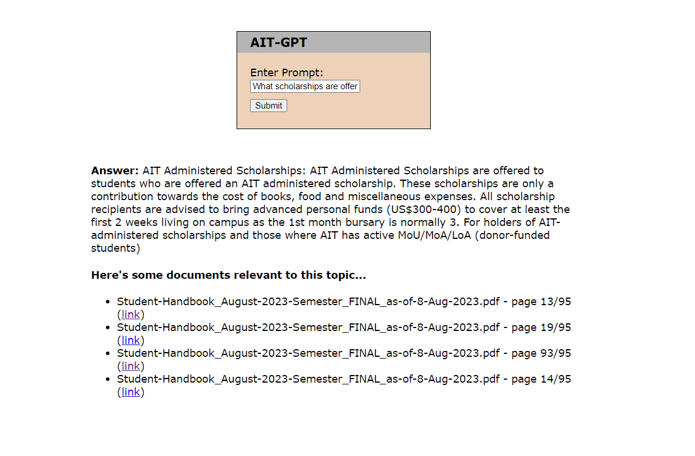

# NLP-A7-AIT-GPT

## Description

AIT-GPT chatbot created using [Instructor](https://huggingface.co/hkunlp/instructor-base) for text embedding, [FastChat-T5](https://huggingface.co/lmsys/fastchat-t5-3b-v1.0) as the text generator, and [LangChain](https://www.langchain.com/) library in Python for building chatbot application. \
The chatbot's domain knowledge is supported using **Retrieval Augmented Generation (RAG)** which retrieve information from the provided source document. \
The source document used in this project is the AIT student handbook as of 8 August 2023, which is available to be downloaded [here](https://students.ait.ac.th/services/regulations_old/student-handbook-2/).

## How to Use:
1) Run the Python script `app.py` located in `NLP-A7-AIT-GPT/app/` directory.
2) Open your browser and go to `127.0.0.1:5000` to access the site locally.
3) Input the question in the provided input box then once you click submit, the answer as well as reference links to the source document will be displayed below.

## How It Works

1. The source document is first chunked where each chunk are transformed into vectors using the text embedding model. The vectors are then stored as embeddings.
2. When the user asked a question, the question is then transfor into a vector which is then used to compute for cosine similarity with the stored embeddings in order to retrieve the document chunks that are most relevant to the user question.
3. Based on our designed prompt template, The user question and the most related document chunks are inputted into the model as question and context respectively. The model then generates the answer.

## Model Analysis

- Using the FastChat-T5 model and our custom prompt template, the model is able to answer the user's prompt about AIT very well when asked about questions related to AIT and the relevant information is also available in the provided source document.
- When asked about information related to AIT that is not available in the source document such as "Who is the current president of AIT?", the model was able to recognize that such information is missing and instead of hallucinating, it answered correctly that the information is not available to be accessed by the model.
- One problem arise when asked about information not related to AIT such as "Who is Barack Obama?", the model answered correctly instead of refusing to answer the question as the model should only answer question related to AIT. As such, certain finetuning techniques such as **Reinforcement Learning with Human Feedback (RLHF)** or **Direct Preference Optimization (DPO)** should be utilized to further improve the model's recognition of its domain boundary.
